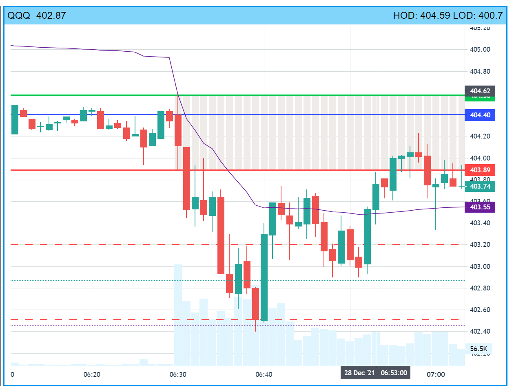
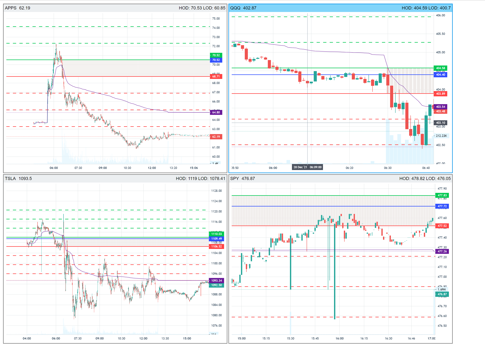

# Tradingview Lightweight Trader

## Build custom ligthweight chart library
1. Clone repo https://github.com/tradingview/lightweight-charts
2. In the repo, run `npm install` to install packages
3. Run `npm run build` to build lightweight chart library
4. The console will say `created ./dist/lightweight-charts.standalone.development.js`. Copy that file to the `dist` fold of this directory